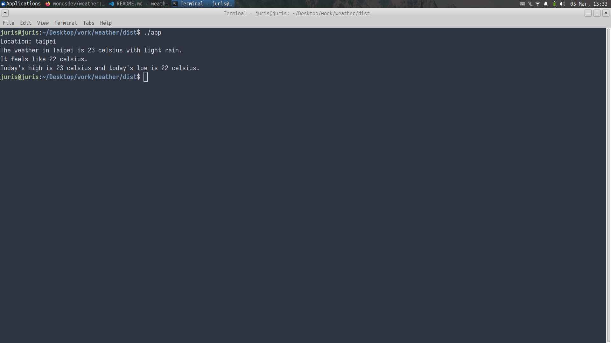

# Weather

English | 正體中文

A command-line Python app that fetches real-time weather data for any city using the [OpenWeatherMap](https://openweathermap.org/) API.

## Features

- Get current temperature (°C)
- See weather conditions (sunny, rainy, cloudy, etc.)
- Check high and low temperature
- Works for any city worldwide

## Installation
No installation required. Download the latest release from the [Releases page](https://github.com/monosdev/weather/releases) and run it directly.

## Running (Linux)

1. Navigate to the download folder.

2. Make the program executable:
```bash
chmod +x app
```

3. Run it:
```bash
./app
```

## Demo



## Roadmap

Planned features for future versions:
- [ ] GUI version
- [ ] Save favorite cities
- [ ] Check humidity and wind speed
- [ ] Color-coded output for easy reading
- [ ] ASCII weather art based on conditions

## License

This project is licensed under the [MIT License](./LICENSE).